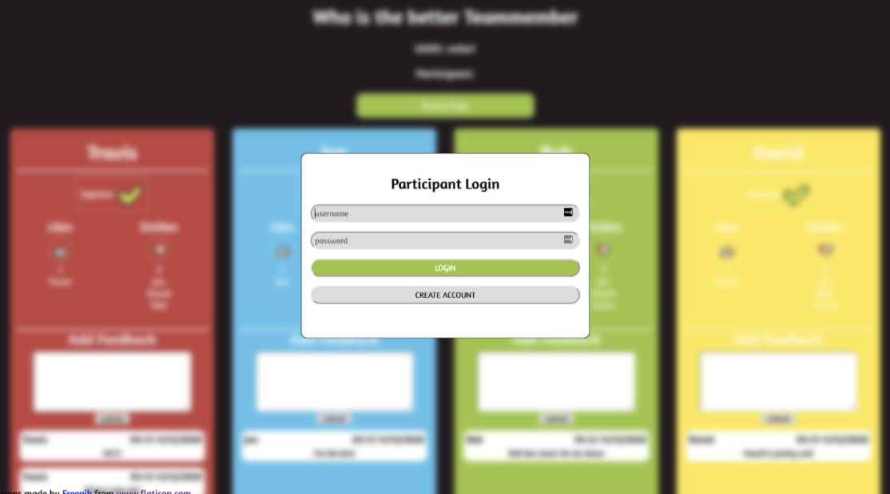
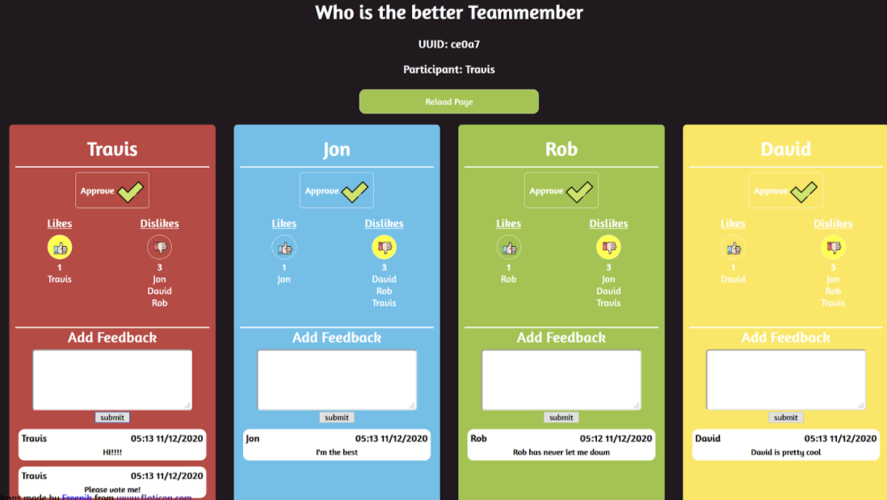

# Software Engineering Group Project

This project was completed for CS3733, Software Engineering, at WPI. My team consisted of Jon Aronoff, Rob Brodin, and Travis Thompson. We built the web application using Amazon Web Services. Jon and Travis focused on the front end development (HTML/CSS, JS, and API Gateway), and Rob and I focused on backend development (Java/Lambda functions, databases, API Gateway). I was specifically responsible for the creating the functionality to approve and delete "choices" (ie a decision that a team makes, such as "what is your favorite flavor of ice cream?"), along with the ability to create users and login.

## Login Page:

## Viewing decision page:

